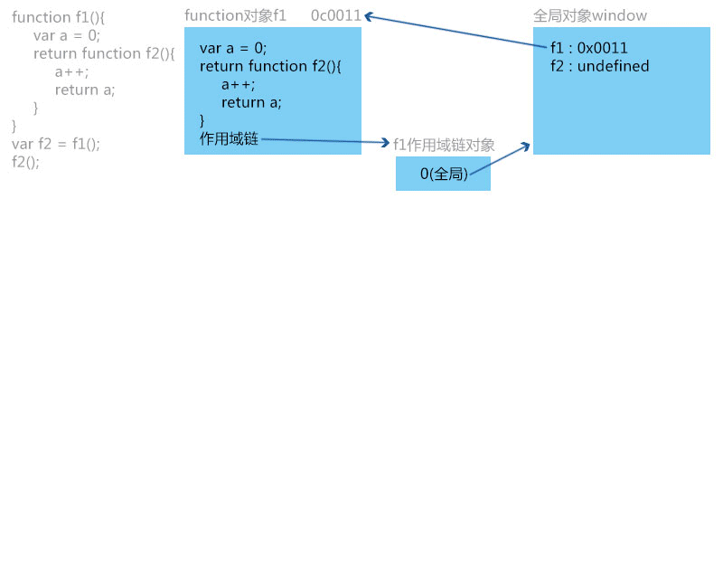
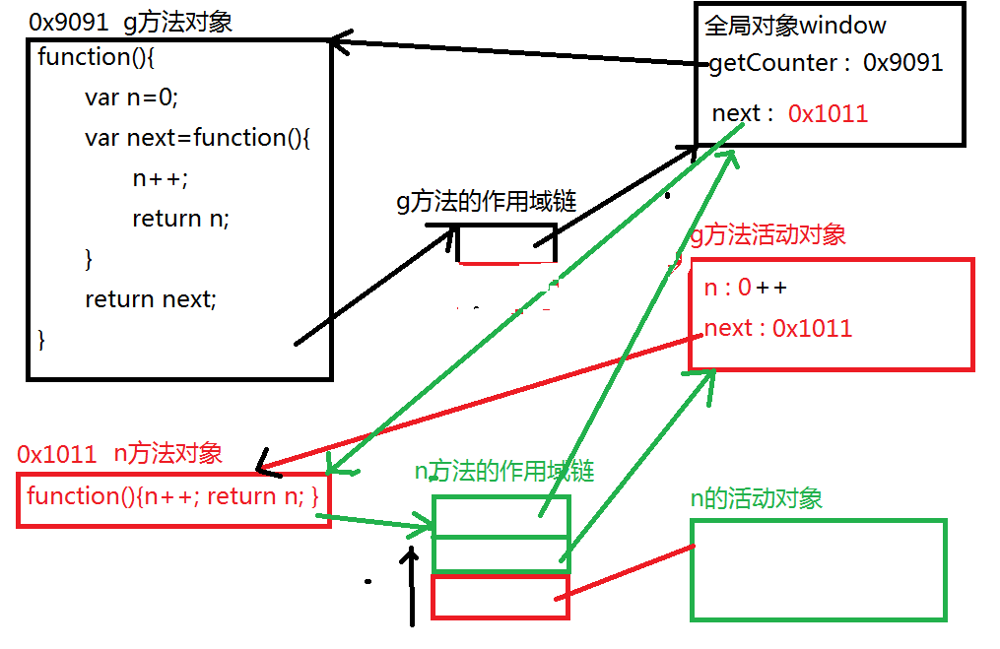

# summary-of-JavaScript-jQuery
some notes for study

HTML: 编写网页内容的语言
CSS：编写网页样式的语言
JavaScript：编写网页交互行为的语言
交互：3步: IPO
1. 输入数据/触发事件 2. 处理数据/响应事件 3. 返回结果

1. 什么是js？
2. 如何编写和运行js
3. 如何保存和使用数据
4. 数据的类型

1. 什么是js?
JavaScript：编写网页交互行为的语言
运行在js解释器/引擎中
*解释执行：先读到的先执行，后读到的相同内容会覆盖前边的内容
JavaScript是互联网第一大语言

Netscape: Navigator  LiveScript
     95年：Java "write once run anywhere"
Netscapt:“像极了Java，一定比Java简单”
     LiveScript-->JavaScript
MS:JScript

ECMA:ECMAScript标准——一纸空文
各浏览器厂商，遵照标准*实现*自己的JavaScript语言

W3C：DOM标准：专门操作网页内容的标准

BOM：专门操作浏览器窗口的编程模型——没标准，各厂商自定义。

JavaScript:ECMAScript（定义核心语法）
          +DOM（定义了操作网页内容的语法）
	  +BOM（定义了操作浏览器窗口的方法）

2. 如何编写和运行js
编写:EditPlus
运行：2种方式：1. 使用浏览器自带的js解释引擎
               2. Node.js——了解
第一个js程序：about:blank-->F12-->console控制台
语法：1. 所有字符串都要用引号包裹
      2. *js区分大小写！*
比如：console.log("Hello world!");
    IE11：console.dir("xxx");
    调用"控制台"的"日志功能"，在控制台中输出一行日志
      document.write("Hello world");
    调用"当前网页"的"输出功能"，在网页中输出一行文字
      write功能：其实向网页中写出一行html内容

如何在网页中编写js程序：3种方式：参照CSS
1. 元素事件中
    事件：元素对鼠标或键盘操作的响
          语法：特殊的属性：on事件名=“js语句”
                比如：单击: onclick="window.alert('')";
		<!--当单击时：-->
		<!--调用浏览器窗口的alert功能，弹出警告提示
    强调：事件中的js语句，只有事件触发时才执行
	document.write();2种情况：
	1. 随网页加载过程输出，写在什么位置就在什么位置输出
        2. 如果网页加载完成后，再调用write，
             会重新启动网页输出流，从第一行开始替换原内容

2. 
   强调：
							 
							 
							 
					

2. 数组的高级API：
    排序：arr.sort([比较器函数]);
默认：将所有元素转为字符串，从头依次比较每个字符的unicode
    如何自定义比较器函数：
           什么是比较器函数：比较任意两数大小的函数
	           规则：将两数相减，返回一个>0或<0或=0的数
    方法的本质：        
    *其实js中一切都是对象，连方法也是对象*
    *只有方法对象是特殊的，可以执行/调用的对象*
    *方法名其实就是引用方法体对象的变量*
                   "底层是关联数组"
    *方法对象也可以作为赋值或当做参数传递，传递时不加()*
    *何时创建方法对象和变量：当程序读到*方法声明*时，已经创建方法对象*

     降序排列：颠倒比较器返回值得正负(x-1);

     栈和队列：
        栈：一端封闭，只从另一端进出，FILO
        从数组尾出入：
	压栈：arr.push(值)
                弹栈：var 值=arr.pop();
       从数组头出入：
                入栈：arr.unshift(值);
                出栈：var 值=arr.shift();

      队列：只能从一端进入，必须从另一端出，FIFO
	入队列：从尾进入：arr.push(值);
                出队列：从头出：var 值=arr.shift();

     何时：只要限制元素进出数组的顺序时，就要用栈或队列

正课：
1. *二维数组*
2. ***字符串***

1. 二维数组：数组中的元素，又引用了另一个子数组对象！
    访问二维数组：数组变量[行下标][列下标]
    *行下标不能越界！*
    遍历二维数组：
          for(var r=0;r<arr.length;r++){//父级循环遍历行
	//内层循环遍历一行中的每一列
          	for(var c=0;c<arr[r].length;c++){
                    //获得正在遍历的元素值: arr[r][c];
                }
          }

2. 字符串：一串字符的集合
       包装类型：见PPT
       为什么使用包装类型：见PPT
       何时使用包装类型：程序在用原始类型调用方法时，自动创建原始类型的包装类对象。用完自动销毁。
鄙视题：
     var str=String(12.345);  
	将Number类型转化为原始类型的字符串
     var str=new String(12.345);
                创建一个包装类型的字符串对象

转义字符（\）：当字符串正文中，出现具有特殊功能的符号时，必须将特殊符号转为文字。

API：大小写转换：
    将str中所有小写字母，改成大写字母：str=str.toUpperCase();
    将str中所有大写字母，改成小写字母：str=str.toLowerCase();
    何时：只要大小写一视同仁时，就用大小写转换。
    
获得指定位置的字符：var char=str.charAt(i);     str[i];
获得指定位置的字符的unicode编号：var code=str.charCodeAt(i)

正课：
1. String API：查找关键字，获取子字符串，替换关键字，分隔
2. 正则表达式：验证格式

1. String API：
    查找关键字：var 位置下标=str.indexOf("关键字");
              特点：懒：一次只能找第一个匹配的。
                       笨：每次默认从头开始查找
                      var 位置下标=str.indexOf("关键字",开始位置); 
                                                                                   -->
                      从指定的“开始位置”向后查找
             结束：“位置下标”为-1，说明找不到了
                      
             var 位置下标=str.lastIndexOf("关键字",开始位置);
				           <--
             特点：从结尾开始，向前查找。
             区别：关键字离开头近，用indexOf
                                离结尾近，用lastIndexOf
                       indexOf先找从头开始第一个匹配的
                       lastIndexOf先找从结尾开始，第一个匹配的

     获取子字符串：var subStr=str.slice(开始位置,结束位置+1);
               var subStr=str.substring(开始位置,结束位置+1);
               区别：substring不支持负数参数
               var subStr=str.substr(开始位置,字符个数);
               区别：不必考虑含头不含尾的问题

    分隔字符串：var subs=str.split("分隔符");
                   将str，以指定的"分隔符"为界，切割成多段
                   subs: 保存每一段的数组
                   不影响原字符串
             特点：切割后的结果，不包含"分隔符"
                       *按""切，相当于每个字符分隔*
                       *按" "切，相当于每个单词分隔*

正课：
1. 替换：
2. *正则表达式*

1. 替换：str=str.replace(/关键字/ig,"替换内容")
         其中:i：忽略大小写；g：全部/全局
                可单独用，也可同时用
         强调：关键字不加引号，改为/ /

   String API中支持模式匹配的只有3个：replace,match,search
        match: 获取所有关键字的内容，无法获得每个关键字的位置
        var kwords=str.match(/关键字/i); --了解
           kwords中仅保存第一个匹配的关键字 --了解
           kwords.index属性中保存了第一个匹配关键字的位置 --了解
        var kwords=str.match(/关键字/ig);
           kwords中仅保存所有匹配的关键字
           kwords.index属性失效
        kwords.length属性，获得关键字的个数

        *如果没有找到匹配的关键字，match方法返回null
        都要先判断!=null，再调用属性或方法*

       search: 查找是否包含关键字
             var index=str.search(reg);
	通过index是否==-1，来判断str中是否包含关键字
                但是，无法确定所有关键字的位置和个数。

      indexOf、match、search：
      1. 原文匹配查找:while+indexOf
      2. 仅希望查找所有关键字的内容，而不关心位置: match
      3. 只关心有没有：indexOf 或 search
                    只要使用模式匹配，只能用search

正则表达式：字符串中字符出现的规则
      作用：检查/验证字符串
      1. 最简单的正则表达式：不带任何特殊符号的字符串原文就是最简单的正则表达式。——只能原文匹配
      2. 字符集：[备选字符]：从备选字符中，多选一匹配
                       [^字符集]：除了字符集中的字符以外，都行！
 	          ^只能用于字符集开头
                      如果字符集是连续的：-代替中间的字符
                      比如：[0-9]：1位数字
                                [a-z]：1位小写字母
                                [A-Z]: 1位大写字母
                               [0-9a-zA-Z]: 1位数字或字母
     3. 预定义字符集：对常用字符集的简化符号
     	\d: [0-9]
                \w： [0-9a-zA-Z_]
                \s: 所有空白字符：空格，换行，制表符等
        一个预定义字符集，也仅能匹配一位
                \大写字母：其对应小写字母字符集的反义
                . : 表示1位任意字符
    4. 量词：{min,max}: 至少出现min次，最多不能超过max次
	用法：用于字符集之后，规定字符集重复出现的次数
	强调：量词仅约束相邻的字符集
	比如：6到8位：{6,8}
                  {min, }: 至少出现min次，多了不限
                比如：6位以上：{6, }
                  {min}: 必须出现min次，不能多不能少
                比如：必须6位：{6}

           ?   +    *:
              ?: 1位，可有可无
              *: 可有可无，不限制位数
              +：至少1位，多了不限
          手机号：
           (\+86或0086)可有可无，至多1次
           空白字符，可有可无，多了不限
           号码必须以1开头
           第二位: 3,4,5,7,8
           剩下几位，必须是数字！
           号码部分总位数11位

     指定匹配位置：
           ^: 用在整个正则表达式的开头，表示必须以正则表达式的规则作为开始。
           $: 用在整个正则表达式的结尾，表示必须以正则表达式的规则作为结束。
           验证：从头到尾，完整匹配。必须前加^，后加$
           查找：仅部分匹配即可。不用加^和$。结尾加g

         *固定套路：1. 匹配字符串开头所有空格：^\s+
                           2. 匹配字符串结尾所有空格：\s+$
                           3. 匹配字符串开头和结尾的所有空格：^\s+|\s+$
        
        \b：区分英文单词的边界。——了解

       课后练习：身份证号：前15位必须是数字: \d{15}
                       后三位可有可无：（      ）?
                                后三位：2位数字+1位数字/xX：\d\d[0-9xX]
                        \d{15}（\d\d[0-9xX]）?
                       中文姓名：[\u4e00-\u9fa5]{2,6}

					   
					   
					   
正课：
1. 在js中使用正则表达式：
             1. RegExp对象：
             2. String对象中的支持正则的API：
2. *Math，*Date，Number。。。

1. 在js中使用正则表达式：
    1. RegExp对象：
	/正则表达式/ig：一旦创建，正则表达式内容不可变
	new RegExp("正则表达式","ig"); 
	在运行时动态改变正则表达式字符串的内容。
       API：reg.exec(str)：同时查找关键字的内容和位置！
                   使用reg中保存的正则表达式从头开始查找匹配关键字
                         每次只找第一个匹配
                        自动将reg对象的lastIndex属性，调整到当前位置后
                         下次，自动从lastIndex位置开始
                        如何使用：1. while循环简单推动exec方法反复执行
                    返回值：数组对象：第1个元素[0]中保存关键字内容
                                       数组对象的index属性中保存了关键字位置
                          如果未找到，或到头，都返回null！

        API：reg.test(input): 
	用reg中的正则表达式*验证*input是否符合格式要求 
                强调：验证要求从头到尾完整匹配：前加^,后加$
                返回值：匹配：true；不匹配返回false
        ?!或?=：先预判input是否大体符合正则表达式的要求
           密码强度：6位以上，必须以字母开头，至少包含一位大写字母以及1位数字
           (?![a-zA-Z]+$) (?![0-9a-z]+$) [a-zA-Z][0-9a-zA-Z]{5，}
           不全由字母组成  不全由数字或小写字母组成

       课后练习：
             验证a元素：<a\s+(.*?)href\s*=\s*['"]([^'"]*)['"](.*?)>
                              RegExp.$1                    RegExp.$2        
             2种模式：
	贪婪模式：从左向右匹配尽量长的内容
                懒惰模式：从左向右匹配最短的内容
             $1...$9：获取*本次*匹配的子模式(圆括号)的内容

正课：
1. String中的正则API
2. Math Date Number

1. String中的正则API：replace match search split
        1. 替换：var reg=/正则表达式/g;
	     str=str.replace(reg,"替换值");
        2. 查找所有关键字的内容：
                     var arr=str.match(reg);
        3. 切割字符串：var arr=str.split(reg);
	 强调：reg是分隔符的规则！

        课后练习：去前后空格！
              匹配前空格：/^\s+/
              匹配后空格：/\s+$/
              匹配前后空格：/^\s+|\s+$/

2. Math: 封装数学计算相关API
       不需要具体对象即可直接调用！
       强调：Math类型不能new对象

   API：Math.round(n): 将n四舍五入*取整*！
            Math.ceil(n): 将n上取整
            Math.floor(n): 将n下取整

            Math.round(23.45); //23
            Math.ceil(23.45); //24
            Math.floor(23.45); //23

            Math.abs(n); 取n的绝对值
            Math.pow(n,m);  计算n的m次方
                     Math.pow(8,2); //64
            Math.sqrt(n); n开平方

            Math.max(n1,n2,n3...); //取所有数中最大值
                    .min(... ...); //取最小数
            固定套路：获取数组arr中的最大/最小值
                  Math.max.apply(Math,arr);
                                   apply自动将arr打散成一个一个的数值
                                   作为多个参数，传递给max方法

            Math.random()： 返回0到1之间的随机浮点数
                                             0<=r<1
            固定套路：任意两数间取随机：min~max
            Math.floor(Math.random()*(max-min+1)+min);

3. Date对象：封装了1个时间点的数值，提供了对时间操作的API
       创建日期对象：
           var date=new Date(); //默认获得当前客户端系统时间
	          自定义时间点：
                           new Date("年/月/日 时:分:秒"); 
                          new Date(年,月,日,时,分,秒);
                          使用毫秒数直接创建：
                          new Date(毫秒数);
       日期对象中封装了：一个巨大的毫秒数
                    从当前时间点到1970年1月1日 0点0分0秒的毫秒数

       日期API：直接修改原日期对象
	1. 每个分量都有一对儿get/set方法
	       比如：now.getHours();   
                                 now.setHours(now.getHours()+1)
                2. 命名：年，月，日，星期   不带s结尾
                             时，分，秒，毫秒    带s结尾
                      比如：now.getMonth();
                3. 取值：每月中的日：从1开始到31结束
                          其余都是从0开始，到进制-1结束
                     注意：月份取值：0-11，现实月份-1修正
                               星期：日-六; 0-6; 星期不必修正
            手册：先找JavaScript-->JavaScript-->js对象-->js日期
                     -->JavaScript Date对象参考手册

        日期计算：2种：
              1. 日期对象可直接相减：结果两时间点的毫秒差
                                                  自己换算进制
            *2. 先取分量，再做计算，最后set回去
           强调：set方法可以自动调整时间进制

正课：
1. Date，Number
2. 异常处理——了解
3. ***Function对象*** 闭包
4. 自定义对象

1. Date：封装一个毫秒数
         创建：var now=new Date();
             自定义时间点：new Date("年/月/日 时:分:秒");
                                   new Date(年,月,日,时,分,秒);
                                   new Date(ms);
         API: var ms=date.getTime();

              1. 每个分量都有一对儿get/set方法
              2. 命名: 年月日星期，不带s结尾
                          时分秒毫秒，带s结尾
              3. 返回值：月中的日：1-31
                             其余都是从0开始，到进制-1结束
                        注意：月：0-11， 用现实月份-1修正
                              星期：0-6, 日-六，不用修正
 
        计算：2种：
           1. 两日期对象相减，除以进制
           2. 先get分量，做计算，再set回去
                     注意：set方法会自动调整进制
      
       日期格式化：
             1. API：date.toLocaleString();  //返回时间的当地格式
                          date.toLocaleDateString();  
		//返回时间的当地格式，只包含日期部分
                          date.toLocaleTimeString();
		//返回时间的当地格式，只包含时分秒部分
             2. 自定义API：见练习format方法

Number类型：
     对任意小数位数四舍五入：
           var n=12.345;
           var str=n.toFixed(2); //只能返回字符串
           n=Math.round(n); //只能四舍五入取整

     自定义API：function roundD(n,d){
                             
                       }

2. 错误处理：
      错误：程序运行时的异常情况，会导致程序退出
      只要发生错误，都会创建一个错误对象：Error
      错误对象有6种类型：
        
SyntaxError：语法错误：改
        TypeError：类型错误：错误的使用了对象的方法！
	比如：console.l0g()  
        ReferenceError：试图从未声明的变量中取值
                比如：console.log(n);
                         n=100;
        RangeError：内置API的参数超范围
                比如：n.toFixed(-2); 
        EvalError
        URIError

    Error对象：ReferenceError: n is not defined
                              name              message

    如何处理异常：
        语法：try{
	       var arr=[];
                       //可能发生错误的代码 
	       //仅包裹可能出错的代码
                 }catch(err){
	       //获得err对象，异常处理
                 }[finally{
	       //无论是否发生异常，都必须执行的代码
	       //一般用于释放资源！
                 }]
    如何抛出自定义异常：throw new Error("自定义异常信息");

3. ***Function对象***
       js中一切都是对象，方法也是对象
       方法名其实就是指向方法对象的引用地址

   重载：相同方法签名，不同参数列表的多个方法
            调用时，根据传入参数个数的不同，动态选择具体执行的方法

   js语法不支持重载：后定义的同名变量会覆盖先定义的
   使用方法对象的arguments对象模拟重载的效果！

正课：
1. ***Function对象***   闭包
2. 自定义对象

1. Function对象：
      js中一切都是对象，方法也是对象
      方法名其实是指向方法对象的引用地址

    重载：js语法不支持重载，但arguments对象模拟重载的效果
    arguments对象：每个方法内，保存传入参数的类数组对象
                1. 在方法调用时，动态创建。
                2. 类数组对象：*Object* like array
	       arguments.length：传入的参数个数
                       arguments[i]：获得传入的每个参数

    创建函数三种方式：
           1. 使用function关键字声明函数：只有此方式能被预读到开头
                     function 方法名(参数列表){方法体; return 返回值}
           2. 使用变量+函数直接量的方式定义：
                var 方法名=function(参数列表){方法体; return 返回值}
			函数直接量
           3. new Function创建对象的方式：
             var 方法名=new Function("参数1","参数2",...,"方法体")
             方式3，很少使用。
             只有希望动态执行代码时，才使用new Function

    匿名函数：没有方法名的函数
          一次性，不需要重用的函数！
    匿名函数2个用途：
        1. 回调函数：函数定义后，交给其他对象或方法使用
                            何时使用，使用几次，与定义者无关
      	arr.sort(function(a,b){return a-b;});
        2. 匿名函数自调：创建匿名函数后，立刻调用！不可重用
                (匿名函数对象)()

   ***闭包***
   1. 变量作用域：
	1. 全局作用域：
                2. 函数作用域：
   2. 作用域链：1个对象：1. 每个函数都有一个
                                     2. 封装了一个函数可用的变量所在的位置
                                     3. 查找顺序是从局部到全局
       方法定义时：会创建2个对象：
                  1. 方法对象：保存方法体本身
                  2. 作用域链对象：保存了方法可用的变量的存储位置
                                   定义时，仅指向全局window
      方法调用时：会创建1个对象： 
                  1. 方法活动对象：本次执行，可用的局部变量
               2. 会在作用域链对象中新增一个引用，指向自己的活动对象
      方法调用后：只有活动对象释放！
                  作用域链对象，指向活动对象的引用，出栈！

   3. 闭包：函数使用了不属于自己的局部变量！
          全局变量：好处：可共享
                          缺点：牵一发而动全身
          局部变量：好处：安全，私有
                          缺点：不可共享

          闭包：提供对局部变量的修改方法，
	   保护局部变量不被擅自篡改
       Step1：将要保护的局部变量和对变量的操作封装在1个方法内！
       Step2：将对变量的操作方法，作为方法对象返回
    
     判断闭包发生三个条件：
             1. 一个局部变量，被局部方法使用
             2. 方法的嵌套
             3. 局部方法被外部方法return！

    闭包作用：保护局部变量。

回顾：
   1. 定义方法时：创建2个对象：
                 1. 方法对象：保存了方法体本身
                 2. 方法的作用域链对象：
                                 1. 每个方法都有唯一的一个作用域链对象
                                 2. 其中存储了该方法可用的变量的存储位置
   2. 调用方法时：创建1个对象：
                 1. 创建当前方法的活动对象：存储方法的局部变量
                 2. 在该方法的作用域链对象中，增加活动对象的引用

   3. 方法调用后：删除1个对象
                 1. 将作用域链中的活动对象引用出栈。
                 2. 删除活动对象

   闭包：保护可重用的局部变量；对局部变量提供专门的修改方法
   三特点：1. 内外函数的嵌套
                2. 内部函数，使用了外部函数的局部变量
                3. 外部函数将内部函数作为对象返回
var a;   
function getCounter(){
   	var n=0;
  	var next=function(){
       		return n++;
   	}
	return next; //0x1011
  }
/*************************************/
   var counter=getCounter();//0x1011
      //0x1011-->function(){ return n++; }
/*************************************/
   console.log(counter());

   n=0;  //作用域默认是全局

   console.log(counter());

   function getFuns(){
       var funs=[];
       for(var i=0;i<3;i++){
           funs[i]=function(){console.log(i);};
       }
       return funs;
   }
   
   var arr=getFuns();
   arr[0](); 
   arr[1](); 
   arr[2](); 

正课：
1. 面向对象：封装，继承，多态
     封装：将相关的属性和方法包装在一个对象中作为整体存储 
	对象：同时保存多个数据和功能的存储空间
                           程序中的对象来自于需求分析中的名词
                           对象用来描述现实中的一个事物
            js中一切都是对象，对象的本质是属性和方法的Hash数组
                                                                             //关联数组
                 对象封装了属性和功能

js中对象分类：内置对象11个:
         String Number Boolean
         Array RegExp Math Error Date 
         全局对象：浏览器下window
         Object Function 
js: ECMAScript（核心语法）
    +DOM（专门操作网页内容） W3C
    +BOM（专门操作浏览器窗口）没标准

    自定义对象：开发人员自己定义属性和功能的对象
    如何定义：3种方式：
          1. 直接量：语法同关联数组
          2. new Object(): 
          3. 使用构造函数/对象模板：创建统一格式的对象
  
    1. 直接量/关联数组的方式：只要创建1个对象时
           var 变量名={ 属性名1:值1 , 属性名2:值2 , };
    2. var 变量名=new Object(); //{}
         变量名.属性名1=值1;
         变量名.属性名2=值2;

    3. 构造函数：对相同结构的对象的统一定义。
                     用于反复创建统一结构的多个对象！
           先定义：
           function 类型名/构造函数名(属性值1,属性值2,...){
                 //对每个属性的赋值：
                 this.属性1=属性值1;
                 this.属性2=属性值2;
           }
           再使用：var 变量名=new 构造函数(属性值列表);
	new：1. 创建空间
                          2. 按照构造函数的要求，装修空间
                          3. 
                                          
      继承：父对象中的属性值，子对象不用创建，就可以直接使用！    
            比如：任何对象都有toString方法！
	自定义对象的toString方法，默认返回的是对象的类型：
                       [object Object]
      多态：

	  回顾：
    1. 面向对象：封装，继承，多态
              封装：将相关属性和功能封装在一个对象中
              继承：父对象中的属性，子对象不需要创建，就可直接使用
	比如：Object对象的toString方法，所有对象都能访问
                        Object对象其实是所有对象的父对象
              多态：不同情况下，表现出不同的状态
	       重写：子对象觉得父对象中的属性不好用
                                可以自己定义同名属性，重写父对象中的属性

2. ***原型与继承***
      new :  1. 开辟空间
                 2. 调用构造函数装修空间
                3. *将新创建的对象，指向构造函数的原型*
     什么是原型：保存所有子对象共有属性值的对象
               所有方法，都有一个prototype属性指向自己的原型
          所有子对象，都有一个__proto__属性指向自己构造函数的原型
     什么属性保存在原型中：希望所有子对象共用的属性*值*

     自有属性：1. 通过对象的变量添加的属性
                     2. 使用this，添加在构造函数中的属性
                         构造函数中的属性，分属不同对象中
     共有属性：放在原型对象中的属性值，都是共有属性

     注意：共有属性只能通过原型对象设置！
               读取时，可通过子对象的变量直接读取。

     删除属性：delete 对象.属性
                     可删除任意对象的任意属性——了解

     自有属性和共有属性的检测：
     1. 检测自有属性：对象.hasOwnProperty("属性名")
     2. 检测继承关系上是否包含属性：“属性名” in 对象

     this：是唯一的一个引用关键字。
             始终指向程序当前正在使用的对象
     this仅用于函数内。
     全局函数：this，始终指向window对象
     对象的方法：this，始终指向调用方法的对象
     构造函数中的this：指刚创建的新对象

     如何获取原型：3种方式：
           1. 构造函数.prototype：必须先知道构造函数的名称
           2. Object.getPrototypeOf(任意对象)
           3. 任意对象.__proto__   IE禁止访问

    *如何实现自定义继承关系*
         1. 修改构造函数的原型为新对象
	未来创建的所有子对象，都继承新的原型对象
               *注意：无法影响已经创建的旧对象*
             语法：构造函数.prototype=父对象
         2. 仅修改一个子对象的原型引用
                只影响一个对象的继承关系，不影响其它子对象
             语法：Object.setPrototypeOf(子对象，父对象)

    检查对象的原型：
          父对象.isPrototypeOf(子对象)

    

## jQuery 

jQuery Day01：
 * 概述：
   * JavaScript的三个核心：
     * ECMAScript：JavaScript的核心(语法)
       * 学习的版本是基于ES5
       * ECMAScript最新版本是2015(6)
     * BOM：浏览器对象模型
     * DOM：文档对象模型
   * 使用JavaScript具有一些问题：
     * 使用起来的语法并不简洁
       * 获取HTML页面中的元素
         * getElementById()
	 * getElementsByName()
	 * getElementsByTagName()
     * 浏览器的兼容性(IE 8)
     * 语句只能单独成句，无法形成链式
   * 为了能解决上述问题，诞生了很多的js库
     * JavaScript类库
 * 自己尝试解决上述js问题
   * 获取id为...的元素
     * document.getElementById()
     * Css的选择器中的"#id"
     * 形式：$("#id")
   * 获取class属性值为...的元素
     * document.getElementsByClassName()
     * Css的选择器中的".className"
     * 形式：$(".className")
   * 获取标签名为...的元素
     * document.getElementsByTagName();
     * Css的选择器中的"element"
     * 形式：$("ele")
   * 问题：
     * 封装id返回的是HTML页面的元素
     * 封装className和tagName返回的是元素数组
   * 为了将来的扩展，自定义一个对象
     * 该对象一定具有属性和方法
     * JavaScript创建对象三种方式
       * 直接量
         var 对象名 = {
		属性名 : 属性值,
		方法名 : function(){}
	 }
       * new Object()
         var 对象名 = new Object();
	 对象名.属性名 = 属性值;
	 对象名.方法名 = function(){}
       * 对象模板
         function 构造器(参数){
		this.属性名 = 属性值;
		this.方法名 = function(){}
	 }
       * 在JavaScript中，函数也是包含属性和方法的对象，称之为函数对象
   * 实现自定义对象与DOM对象进行转换
   * 封装innerHTML属性
     * ele.innerHTML = "";
     * ele.innerHTML
     * 将上述作用封装出一个方法html()
   * 封装getAttribute()和setAttribute()方法
     * getAttribute(name)
     * setAttribute(name, value)
     * 封装attr()
   * 创建option标签
     * $("<option value='bj'>北京</option>")
   * appendChild()
     * append()
 
 * 回顾JavaScript OOP：
   * 概述：
     * JavaScript是基于原型的面向对象
     * 其他面向对象语句是基于类的面向对象
   * JavaScript对象至少包含：属性和方法
   * 自有属性与原型属性的区别：
     * 自有属性：在构造器中定义的
       var 对象 = new 构造器();
       * 只读不可写
     * 原型属性：在原型中定义
       var 对象 = new 构造器();
       
	   
	   
jQuery Day02：
 * 概述：
   * jQuery是一个JavaScript类库
   * jQuery封装了DOM操作、动画效果和Ajax异步交互等
   * JS库目前的数量无法统计 - 上千种
   * 06年发布第一版本
   * jQuery五种分类：
     * jQuery - Web前端
     * jQuery UI - 提供一系列的UI集成
     * jQuery mobile - 专门针对移动开发
     * junit - 提供js代码的单元测试
     * mozzil - 选择器扩展
   * jQuery宗旨 - write less, do more
   * jQuery 2.x版本
     * 最初推出时：不再支持IE浏览器
     * 后面推出时：不再支持IE 8及之前版本
 * jQuery的基本用法：
   * jQuery的语法：
     * $(expr) - expr可以表示为选择器
     * $符号：表示的是jQuery对象
       $ === jQuery
   * jQuery不成文的规则：
     * 使用jQuery的选择器获取元素时，定义的变量前要使用"$" - 标示当前是jQuery对象(区别于DOM对象)
   * jQuery的使用步骤：
     * 引入jQuery的js文件
     * 使用jQuery的选择器获取HTML页面元素
     * 使用jQuery的API方法完成需求
   * 注意：
     * 当前使用jQuery的选择器或API方法，得到的都是jQuery对象(会使用"$"标示)
   * jQuery对象和DOM对象
     * jQuery对象转换为DOM对象：
       * jQuery对象.get(index)方法
         * 该方法返回的就是DOM对象
       * jQuery对象实际是数组对象
         * jQuery对象[下标] - 返回DOM对象
     * DOM对象封装为jQuery对象：
       * $(DOM对象) - 返回的就是jQuery对象
 * jQuery API
   * 选择器
     * 延续Css中的选择器的用法(扩展)
       * #id .class parent > child
     * 九大选择器
       * 基本选择器
       * 层次选择器
         * 祖先元素 空格 后代元素
	 * 父元素>子元素
	 * 指定元素+后一个兄弟元素
	 * 指定元素~后所有兄弟元素
       * 过滤选择器
         * 基本选择器
	   * :first - 获取指定元素中的第一个
	   * :last - 获取指定元素中的最后一个
	   * :even - 获取指定元素中的角标为偶数
	   * :odd - 获取指定元素中的角标为奇数
	   * :eq(index) - 获取指定元素中角标为index
	   * :gt(index) - 获取指定元素中的角标大于index
	   * :lt(index) - 获取指定元素中的角标小于index
	   * :header - 获取h1至h6之间的标题元素
	   * :animated - 获取正在执行动画效果的元素(该动画是由jQuery完成的)
	   * :not(selector) - 获取指定元素中不为selector的元素
	 * 内容选择器
	   * :contains(text) - 获取指定元素中的文本包含text
	   * :empty - 获取指定元素中既不包含子元素也不包含文本元素
	   * :parent - 获取指定元素中包含子元素或文本元素
	   * :has(selector) - 获取指定元素中包含指定selector
	 * 可见度选择器
	   * :hidden - 获取指定元素中隐藏
	   * :visible - 获取指定元素中可见
	 * 属性选择器
	   * [attr] - 获取指定元素中包含attr(属性名)的
	   * [attr!=value] - 获取指定元素中不包含attr=value的(包含没有attr属性的)
	   * [selector1][selector2][selectorN] - 多个属性过滤选择器并列使用(交集)
	 * 子元素选择器
	   * :nth-child(index) - 获取指定元素中子元素为第index个(是从1开始)
	   * :first-child - 获取指定元素中子元素为第一个
	   * :last-child - 获取指定元素中子元素为最后一个
	   * :only-child - 获取指定元素中子元素只有一个
	 * 表单属性选择器
	   * :checked - 获取指定元素中包含checked属性(checkbox、radio)
	   * :selected - 获取指定元素中包含selected属性
	   * :disabled - 获取指定元素中包含disabled属性
	   * :enabled - 获取指定元素中不包含disabled属性
	 * 表单选择器
	   * :image - 匹配的是input元素的type="image"，并不是元素
	   * :input - 匹配input, textarea, select 和 button 元素
     * 总结：
       * 数量众多，不好掌握
       * 单一用法简单，难的是混合使用
       * 建议：不要记，学会查找帮助文档
   * DOM操作  

jQuery Day03：操作DOM
 * 回顾DOM：
   * 获取HTML页面元素
     * getElementById()
     * getElementsByName()
     * getElementsByTagName()
     
     * getElementsByClassName()
       * 问题：浏览器兼容性不好
     * querySelector(className)
     * querySelectorAll(className)
       * 性能差
   * 遍历HTML页面元素：
     * 节点方式：
       * 父节点：parentNode
       * 子节点：
         * childNodes
	 * firstChild
	 * lastChild
	 * 问题：浏览器解释子节点时，将换行视为子节点
	 * 解决：使用getElementsByTagName()方法
       * 兄弟节点：
         * 上一个兄弟节点
	 * 下一个兄弟节点
     * 元素方式
       * 父元素：parentElement
       * 子元素：
         * children
	 * firstElementChild
	 * lastElementChild
       * 兄弟元素
   * 创建HTML页面元素：
     * 元素节点：createElement(标签名)
     * 文本节点：createTextNode(文本内容)
     * 属性节点：createAttributeNode(属性名)
       * 属性节点不是子节点
   * 操作属性：
     * getAttribute(name)
     * setAttribute(name, value)
     * removeAttribute(name)

     * getAttributeNode()
     * setAttributeNode()
     * removeAttributeNode()
   * 插入HTML页面元素：
     * parent.appendChild(child)
       * 子节点列表中的最后
     * parent.insertBefore(newChild,oldChild)
       * 插入在指定子节点的前面
     * 没有insertAfter()方法
   * innerHTML\innerText\textContent等
 * 查询：
   * html() - 封装innerHTML属性
     * 作用：
       * html()：返回第一个匹配的元素的内容
       * html(text)：设置所有匹配的元素的内容
     * 注意：如果遍历jQuery对象时，遍历中jQuery对象[下标]得到的依然是DOM对象
   * text() - textContent\innerText
     * 作用：
       * text()：返回所有匹配的元素的文本内容
       * text(text)：设置所有匹配的元素的文本内容
     * 注意：不存在浏览器兼容性问题
     * jQuery的特点：
       * 替我们完成浏览器兼容性的功能
       * 使用jQuery时不需要再考虑浏览器兼容性问题(除2.0.x版本)
   * val() - 封装HTML页面元素的value属性
     * 作用：
       * val()：返回的第一个匹配的元素的value属性值
       * val(value)：设置匹配所有的元素的value属性值
   * attr() - 封装getAttribute()和setAttribute()
     * 作用：
       * attr(name)：返回第一个匹配的元素的属性值
       * attr(name, value)：设置匹配所有的元素的属性
 * 样式操作
   * 就是操作Css样式(元素具有class属性)
   * attr()方法：
     * 由于class是元素的属性
     * 使用attr()方法设置或添加样式的
       attr("class",className)
   * addClass(className)方法：添加或设置样式
   * removeClass()
     * removeClass()方法：
       * 将所有添加上的样式全部删除
     * removeClass(className)方法:
       * 将制定的样式删除(如果还有其他样式的话不会删除的)
   * toggleClass()方法：切换方法
     * 效果：是在没有样式与指定样式之间切换
       * 如果没有任何样式，相当于addClass(className)
       * 如果具有指定样式，相当于removeClass(className)
     * 注意：并不是在两个指定样式之间切换
   * hasClass(className)方法：判断当前元素是否含有指定class
   * css()
     * css(name, value)方法：
       * name：Css的属性名
       * value：Css的属性值
     * css(name)方法：根据属性名获取属性值
 * 遍历节点
   * 父元素：parent()
     * 注意：该方法不接受任何参数
   * 子元素：children([selector])
     * children()：获取的是指定元素的所有子元素
     * children(selector)：获取的是指定元素的指定子元素
   * 兄弟元素：
     * 上一个兄弟元素：prev([selector])
     * 下一个兄弟元素：next([selector])
     * 所有兄弟元素：siblings([selector])
       * 选择器：获取指定元素后面所有兄弟节点
         selector ~ selector
   * 通用查找方法：find(selector)
 * 创建元素
   * 延续DOM的方式的话：
     * 创建元素节点：$(HTML代码)
     * 设置文本内容：$().text()
     * 设置属性值：$().attr()
     * 添加节点：append()
   * jQuery提供了比较简便方式：
     $(目标元素).append($(新元素));
 * 插入元素
   * 内部插入
     * append()
     * appendTo()
     * prepend()
     * prependTo()
   * 外部插入
     * before()
     * insertBefore()
     * after()
     * insertAfter()
 * 删除元素
   * remove()方法：
     * 删除自身元素及后代元素
   * empty()方法：
     * 删除后代元素，但保留自身元素
     * 更多适用于清空
 * (了解)复制元素
   * clone()
 
 * 扩展：
   * console.log() - 写日志
   * console.info() - 写信息
   * console.warn() - 写警告
   * console.error() - 写错误

jQuery Day04：事件
 * JavaScript中的事件
   * 绑定事件
     * <button onclick="pushme();">点我</button>
       * 哪些事件允许绑定在哪些元素的?参考DHTML帮助文档
     * 通过JavaScript代码方式进行绑定：
       * 元素.onclick = function(event){}
       * 元素.addEventListener(事件名称,处理函数)
   * 常用事件：
     * onclick
     * ondbclick
     * onchange
     * on...
 * jQuery中的事件
   * 完成HTML页面加载
     * window.onload = function(){}
       * 当HTML页面加载完毕后再执行以下代码
       * 上述代码保证先加载HTML页面再执行js代码
     * jQuery中是否提供了类似的事件?
       * $(document).ready(function(){});
       * $().ready(function(){});
       * $(function(){});
     * ready()与onload之间的区别：
       * ready()
         * 简写写法
	 * 执行的效率高
	 * 允许在一个HTML页面中出现多个
	 * 在HTML页面的元素、属性和文本加载完毕后再执行代码
       * onload
         * 没有简写
	 * 执行的效率低
	 * 在一个HTML页面只能出现一个
	 * 在HTML页面中的所有内容全部加载完毕后再执行代码
   * jQuery与其他js库合并使用：
     * jQuery中的$的用法
       * $ - jQuery
       * noConflict()方法：
         * jQuery将$标示符的控制权交给其他js库
     * 其他js库中也可能使用了$
       * prototype.js
       * YUI - Yahoo user interface
       * Mootools - 更轻量4KB
       * Ext_js
       * ...
     * $( )工厂函数 - 被大量地应用在各种js库
   * 内容回顾：
     * 节点树：
       * 父节点：parentNode
       * 子节点：
         * childNodes
	 * firstChild
	 * lastChild
       * 兄弟节点：
         * 上一个兄弟
	 * 下一个兄弟
       * 问题：
         * 换行问题 - 浏览器解释为子节点
	 * 使用getElementsByTagName()方法
     * 元素树：
       * 父元素：parentElement
       * 子元素：
         * children
	 * firstElementChild
	 * lastElementChild
       * 兄弟元素
   * 事件处理
     * 事件绑定与事件解绑
       * 事件绑定：bind()
         * bind(type, [data], fn)
	   * type：指的是需要绑定的事件名称
	   * data：可选项，指的是向绑定事件的处理函数中传递的数据
	   * fn：指的是绑定事件后的处理函数
       * 事件解绑：unbind()
         * unbind([type], [fn])
	   * type：可选项，指的是需要解绑的事件名称
	   * fn：可选项，指的是解绑事件后的处理函数
       * 事件绑定的使用
         * 利用bind()事件绑定一个事件名称
	 * 利用bind()事件绑定多个事件名称
	   * bind()事件中的第一个参数type
	     事件名称1 空格 事件名称2 ...
       * 事件解绑的使用
         * 默认调用时，无论是绑定一个事件还是绑定多个事件，一律解绑
	 * 如果传递需要解绑的事件名称，只会解绑指定的事件名称
	   * 可以指定一个事件名称
	   * 也可以指定多个事件名称
     * 事件切换
       * hover(over, out)方法
         * 用来模拟mouseover和mouseout
     * (了解)模拟事件操作
       * 允许模拟出上述所有已实现的事件内容
       * trigger()方法：用于模拟事件的方法
         $().click()
	 $().bind("click")
	 $().trigger("click")
     * jQuery中的事件对象
       * 其实并不是jQuery单独提供出来的
       * 而是在DOM事件中就已经存在的
       * jQuery中的事件，封装DOM事件得来的
       * jQuery中的事件，并且将DOM事件中的事件对象一并封装起来
       * 参考DOM事件中的事件对象
     * 事件冒泡
       * addEventListener(事件名称,处理函数)
         * 按照之前的方式解释
   * 扩展内容：
     * is(expr)方法：
       * 作用：用于判断指定元素的情况
       * expr：表达式(选择器)
       * 返回值：Boolean值
       * 让我们可以实现使用jQuery的选择器来完成判断
     * jQuery动画的方法：
       * show(时间)方法：显示
       * hide(时间)方法：隐藏
     * jQuery中this的用法：
       * this的使用，必须要在具有上下文环境中
       * this本身没有任何含义
       * this更多的使用，都是用于替代(指代)具有对象或元素
       * 建议：能不用就别用
   * 
   
jQuery Day05：
 * 动画效果：
   * 显示与隐藏：
     * show(时间)
     * hide(时间)
   * 垂直滑动效果：
     * slideDown(时间)
       * 向下滑动
       * 具有show()方法的作用
     * slideUp(时间)
       * 向上滑动
       * 具有hide()方法的作用
   * 淡入淡出效果：
     * fadeIn()
       * 淡入的效果
       * 具有show()方法的作用
     * fadeOut()
       * 淡出的效果
       * 具有hide()方法的作用
   * 自定义动画：
     * animate(params, options)
       * params:设置当前自定义动画效果
         {
	    key : value,
	    key : value
	 }
       * options:
         * duration：表示动画的速度(预定义或毫秒值)
	 * complete：动画执行完的处理函数
	 * queue：
	   * 如果为false的话,该动画不载入动画序列
	   * 如果为true的话,刚好相反
 * 类数组的操作
   * 概述：
     * 类数组：类似数组的结构
     * jQuery对象的结构类似于数组的结构
   * 方法：
     * get(index)方法
       * 根据index下标返回DOM对象
     * index(Obj)方法
       * 根据jQuery对象返回DOM对象对应的下标
     * length属性
       * 返回当前jQuery对象所包含的DOM对象的个数
   * 遍历(隐式迭代)
     * 概述
       * 遍历的过程中,开始、过程及结束全部可控,这种方式我们称之为显式迭代
       * 遍历的过程中,只关注开始和结束,过程并不关注,这种方式我们称之为隐式迭代
     * 实现
       * $(expr).each(callback)
         * callback:表示回调函数
	   function(index, domEle){}
	   * index:表示遍历当前jQuery对象的下标
	   * domEle:表示遍历当前jQuery对象中的每一个DOM对象
       * $.each(object, [callback])
         * object:表示当前遍历的jQuery对象或数组
	 * callback:回调函数
	   function(index, domEle){}
	   * index:表示遍历当前jQuery对象的下标
	   * domEle:表示遍历当前jQuery对象中的每一个DOM对象
     * 注意：
       * 两个each()方法的回调函数是相同的
       * 两个each()方法的回调函数允许不写形参的
         * 如果不写形参，需要使用this指代形参中的domEle
	 * 不然的话，在each()方法中是无法使用形参内容的
       * 形参domEle表示的是DOM对象，并非jQuery对象
 * 扩展：jQuery底层代码(判断jQuery对象为啥是数组对象)
   var jQuery = function(selector, context){
	return new jQuery.fn.init();
   }
   jQuery.fn.init = function(){
	return jQuery.makeArray()
   }
   jQuery.makeArray = function(){
	var ret = [];
	return ret;
   }
 
 * jQuery插件
   * 官方插件
     * 可以在jQuery官方网站上查找到的
     * 提供插件的下载、文档、Demo等内容
   * 民间插件
     * 在jQuery官方网站上找不到的
     * 比较乱，质量参差不齐
       * EasyUI
       * ...
     * 查找办法：
       * 在百度搜索框输入：jQuery 插件
       * 在github网站搜索：jQuery
   * 插件的数量
     * 基本上HTML页面需要完成的功能,都可以找到对应的插件来完成
 * 如何使用插件：
   * 在HTML页面中先引入jQuery的js文件
   * 在HTML页面中再引入jQuery插件文件
 * 日期插件
   * 错误：
     * 在HTML页面中引入外部文件(JavaScript\Css)时，目录中不能包含中文或空格，引起乱码
   * 步骤：
     * 将插件目录拷贝到相关目录中
       * 不能包含中文或空格
     * 在HTML页面引入jQuery文件
     * 在HTML页面引入WdatePicker.js文件
     * 在HTML页面中定义<input class="Wdate">
     * 在<script>中绑定focus事件并调用WdatePicker()方法
   * 属性：
     * 传递给WdatePicker()方法进行自定义控件样式(参考PPT 27P)
     * 时间格式：
       * yyyy-MM-dd hh:mm:ss
       * yyyy/MM/dd
       * yyyy.MM.dd
       * yyyy年MM月dd日
     * 修改日期格式：
       * dateFmt属性：用于显示的日期格式
       * realdateFmt属性：让电脑来识别(提交给服务器端\数据库操作)
         * "yyyy-MM-dd"日期格式是通用格式
     * minDate和maxDate属性：
       * 设置最小日期和最大日期
       * 注意：设置最小和最大日期的格式，对应上述的realdateFmt属性值
   * 函数
     * 参考日期插件官方网站的相关说明
   * 事件
     * 选择日期
       * 选择日期时：onpicking
       * (更多)选择日期后：onpicked
     * 清除日期
       * 清除日期时：onclearing
       * (更多)清除日期后：oncleared
   * 对象：dp
     * dp.cal.getDateStr()
     * dp.cal.getNewDateStr()
 * jQuery UI
   * 使用jQuery UI
     * 引入jQuery UI提供的主题文件(Css)
     * 引入jQuery文件(js)
     * 引入jQuery UI文件(js)
   * open()和close()
   * showModelDialog()方法：显示模式对话框
   
   
   
jQuery Day06：
 * formValidator插件：
   * 概述：
     * 作用：表单验证
     * 意义：封装很多预定义的方法
   * 使用：
     * 在HTML页面的顶部引入jQuery文件
       * 经过实际测试目前最新版本jQuery
       * 该表单验证插件提供的jQuery是1.4.4版本
     * 在HTML页面的顶部引入Css文件
     * 在HTML页面的顶部引入validator.js文件
     * 在HTML页面的顶部引入regexValidator.js文件
   * 方法：
     * $.formValidator.initConfig()
       * 作用：完成表单验证初始化配置
       * 选项：
         * validatorGroup：对验证进行分组
	   * 多表单验证或不同功能的验证
	 * submitOnce：验证成功后,提交表单所有按钮不可用
	   * 设置值为Boolean值
	 * onSuccess：验证成功后回调函数
	   * 完成对应表单的提交功能
	 * onError：验证失败后回调函数
	   * 完成错误提示信息的功能
     * $(expr).formValidator()
       * 作用：为表单验证设置相关提示信息
       * 选项：
         * onFocus：对应元素获取焦点时的提示
	 * onCorrect：对应元素验证成功后的提示
	 * onEmpty：对应元素为空时的提示
	 * onShow：对应元素默认提示
       * 注意：
         * 如果不设置对应的提示信息的话,使用formValidator插件底层提供的信息
   * 验证：
     * regexValidator()
       * 作用：正则表达式验证
       * 选项：
         * regExp：定义使用的正则表达式
	 * onError：正则表达式不匹配的情况下的错误提示信息
	 * param：指的是正则表达式中使用的参数
	   * g - 全局匹配
	   * i - 不区分大小写
	   * m - 多行匹配
       * 注意：
         * 定义正则表达式时,类型是string类型(不需要定义//,而是"")
     * inputValidator()
       * 作用：元素验证方法
       * 选项：
         * min：表示对应元素值的最小长度\值
	 * max：表示对应元素值的最大长度\值
	 * onError：匹配不成功后的错误提示信息
	 * defaultValue：设置对应元素的默认值
     * compareValidator()
       * 作用：验证对应元素值与指定元素值是否相等(小于\大于)
       * 选项：
         * desID：指定元素的ID值
	   * 注意：只需要指定元素的ID值
	 * operateor：比较符号
	   * 注意：相等使用的是"=",不是"=="
	 * onError：不匹配时错误提示信息
     * AjaxValidator()
       * 作用：异步请求时使用的验证内容
       * 放在Ajax的内容中(待定)
 * 特殊情况：
   * 在一个HTML页面中,使用了多个jQuery插件时
     * 问题：每个插件所支持的jQuery版本不同
     * 解决：找到一个每个插件都支持的版本
 * zTree插件(树控件)：
   * 
 * 
 
 
 
jQuery Day07：
 * 开发插件：
   * 概述：
     * jQuery提供了很多的插件供我们使用
       * 问题：
         * 我们所要实现的功能并不需要那么多的功能
	 * 使用的第三方插件,本身都比较强大
	 * 一般第三方插件的体积都不小
	 * 我们一个Web应用开发,会使用多个jQuery插件
	 * 导致我们的Web应用体积过大
     * 根据我们自己的需求,定制自己的jQuery的插件
       * 自定义插件使用上没有任何问题(自己写的)
       * 每个功能相对来讲比较单一(体积小)
       * 完成各个功能之间的整合
     * 自定义插件的好处:
       * 整合功能模块
       * 维护或升级可控
       * 插件体积小
       * 没有插件之间的冲突(版本)
   * jQuery的插件种类:
     * 全局函数插件
       * 全局函数 - $.each(obj,function(){})
       * 例如目前开发了一款全局函数插件myp.js
         * 自定义全局函数插件的方法调用:$.sayMe()
     * 对象函数插件
       * 对象函数 - $(expr).each(function(){})
       * 例如开发一款对象函数插件myp.js
         * 自定义对象函数插件的方法调用:$().sayMe()
     * 选择器插件(很少出现)
       * jQuery本身提供很多的选择器
       * 根据jQuery的插件机制,继续扩展jQuery的插件
       * 举例:XPath插件
         * 作用:用于解析XML文件
	 * jQuery官方插件(官方团队出品)
   * jQuery的插件机制：
     * 全局函数插件
       * jQuery.extend(object)
     * 对象函数插件
       * jQuery.fn.extend(object)
   * 插件的使用：
     * 使用插件提供的方法时,与使用jQuery本身提供的方法没有不一样的
     * 所谓的插件就是根据jQuery提供的机制,为jQuery来扩展方法
   * 全局函数插件与对象函数插件的区别：
     * 全局函数插件
       * jQuery.extend()
       * $.插件方法()
       * 一般用于与HTML页面无关
     * 对象函数插件
       * jQuery.fn.extend()
       * $(expr).插件方法()
       * 一般用于与HTML页面有关
 * 

